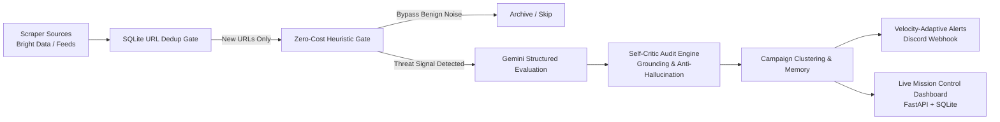

# 🛡️ Threat Radar — Personalized Cybersecurity Intelligence

[](https://www.python.org/downloads/)
[](https://fastapi.tiangolo.com)
[](https://ai.google.dev/)
[](https://brightdata.com)
[](LICENSE)

**Threat Radar** is an autonomous, agentic cybersecurity pipeline designed to protect early-career developers, students, and freelancers from targeted digital threats. It ingests intelligence from developer platforms and threat feeds, filters out benign noise using local zero-cost heuristic gates, analyzes high-signal lures with **Gemini Flash**, and self-corrects using an integrated **Self-Critic Audit Engine**.

---

## ⚡ Key Capabilities



### 1. 🎯 Hyper-Targeted Threat Intelligence
Anchored around the **"User Zero"** profile (developers, students, and freelancers):
* **Fake Take-Home Assessments**: Malicious GitHub repos harboring `postinstall` credential stealers.
* **Task & Deposit Fraud**: Telegram/WhatsApp work-from-home gigs demanding upfront deposits.
* **Supply Chain Poisoning**: Typosquatted npm/pip packages and rogue IDE extensions.
* **Financial & UPI Phishing**: Fake courier redelivery SMS and urgent KYC suspension alerts.

### 2. ⚡ Multi-Stage Token-Efficiency Architecture
* **SQLite URL Hash Gate**: Eliminates duplicate scrapings at zero credit cost.
* **Composite Intent-Bucket Heuristic Gate**: Regex-based evaluation of title + body that filters out ~95% of benign discussion before calling LLMs.
* **Dual-Tier Scraping**: Bright Data Scraper Studio collectors with seamless local fallback to public feeds (GitHub Advisories, HackerNews, Reddit r/Scams).

### 3. 🧠 Self-Critic Audit ("The Agent Watching Itself")
Every LLM-generated payload undergoes automated grounding verification:
* Strips ungrounded claims and hallucinations from the output.
* Downgrades over-reactions and corrects mismatched risk levels.
* Records a full audit trail (`SELF_CORRECTED` vs `VERIFIED`) stored in SQLite.

### 4. 🧬 Velocity-Adaptive Campaign Clustering
Clusters isolated threat reports into cohesive campaign fingerprints (e.g. `DEV_NPM_POSTINSTALL_STEALER`, `CAREER_TELEGRAM_TASK_DEPOSIT`). Campaigns identified as **RISING** automatically lower alert thresholds to intercept outbreaks early.

### 5. 🔍 Interactive Lure Interceptor (Threat Scanner)
A real-time scanner on the web dashboard where users can paste suspicious recruiter messages, repository links, or SMS text to receive an immediate verdict, trap explanation, and actionable safety steps (with offline heuristic fallback).

### 6. 🔧 Autonomous Scraper Self-Healing
Monitors scraper health telemetry. When DOM mutations or broken selectors occur, it executes `@brightdata/cli scraper heal` subprocess workflows to repair extraction logic autonomously.

---

## 🏗️ Architecture & Project Structure

```
threat-radar/
├── main.py                  # CLI orchestrator (run, once, serve, pipeline_and_serve)
├── config.py                # Central configuration, thresholds, and User Zero persona
├── db/
│   └── database.py          # Async SQLite database interface (schema, campaigns, telemetry)
├── engine/
│   ├── heuristics.py        # Zero-cost intent-bucket heuristic gate
│   ├── evaluator.py         # Gemini threat intelligence evaluator
│   ├── critic.py            # Self-Critic audit engine (anti-hallucination)
│   ├── scanner.py           # Interactive Threat Scanner & Lure Interceptor
│   └── schemas.py           # Pydantic schemas for structured intelligence payloads
├── scrapers/
│   ├── brightdata.py        # Bright Data REST API client & self-healing CLI hooks
│   └── runner.py            # Discovery → Dedup → Detail → Sanity → Save pipeline
├── notifier/
│   └── discord.py           # Rich color-coded Discord webhook embeds
├── web/
│   ├── app.py               # FastAPI backend & API routes
│   ├── templates/           # Jinja2 templates (index.html)
│   └── static/              # Dark minimal CSS design system (style.css)
└── tests/                   # Integration and self-healing test suites
```

---

## 🚀 Quickstart Guide

### Prerequisites
* **Python 3.11+**
* [**uv**](https://docs.astral.sh/uv/) (recommended) or standard `pip`
* **Node.js & npx** (for Bright Data CLI self-healing hooks)

### 1. Clone & Install Dependencies
```bash
git clone https://github.com/PrakhidhaChawdhury/threat-radar.git
cd threat-radar

# Create virtual environment and sync dependencies using uv
uv venv
uv pip install -e .
```

### 2. Configure Environment Variables
Copy `.env.example` to `.env`:
```bash
cp .env.example .env
```
Fill in your API keys in `.env`:
```ini
# Gemini API Key (Required for full LLM analysis)
GEMINI_API_KEY=your_gemini_api_key_here

# Bright Data API Key & Collector IDs (Optional / Fallbacks included)
BRIGHTDATA_API_KEY=your_brightdata_api_key_here
GITHUB_ADVISORIES_COLLECTOR_ID=your_collector_id_here
HACKERNEWS_SECURITY_COLLECTOR_ID=your_collector_id_here

# Discord Webhook URL (Optional for alerts)
DISCORD_WEBHOOK_URL=https://discord.com/api/webhooks/...

# Pipeline Configuration
RELEVANCE_THRESHOLD=8
POLLING_INTERVAL_MINUTES=30
```

---

## 🖥️ Running the Application

Threat Radar provides flexible CLI commands via `main.py`:

### Start Web Dashboard Server
```bash
uv run python main.py serve --host 127.0.0.1 --port 8000
```
Open [http://localhost:8000](http://localhost:8000) to view the mission control dashboard, live threat feed, scraper telemetry, and interactive scanner.

### Run a Single Pipeline Cycle (Demo / Test)
```bash
uv run python main.py once
```
Runs one full cycle: fetches new items, applies heuristic filters, runs Gemini evaluation and Self-Critic audit, clusters into campaigns, and sends qualified alerts.

### Run Continuous Polling Daemon
```bash
uv run python main.py run
```
Runs the pipeline continuously every `POLLING_INTERVAL_MINUTES` in the background.

### Run Pipeline + Web Dashboard Simultaneously
```bash
uv run python main.py pipeline-and-serve
```

---

## 🌐 API Reference

| Method | Endpoint | Description |
| :--- | :--- | :--- |
| `GET` | `/` | Main HTML mission control dashboard |
| `GET` | `/api/threats` | JSON feed of recent analyzed threat reports |
| `GET` | `/api/campaigns` | Active clustered threat campaigns and velocity stats |
| `GET` | `/api/stats` | Summary statistics, LLM bypass rate, and filter metrics |
| `GET` | `/api/telemetry` | Scraper health telemetry logs |
| `POST` | `/api/scan` | Scan raw suspicious text/links against campaign memory |
| `POST` | `/api/simulate-heal` | Trigger simulated scraper degradation and recovery |

---

## 🧪 Testing

Run test suites using `pytest`:
```bash
uv run pytest tests/
```

---

## 📄 License
Distributed under the MIT License. See `LICENSE` for details.
